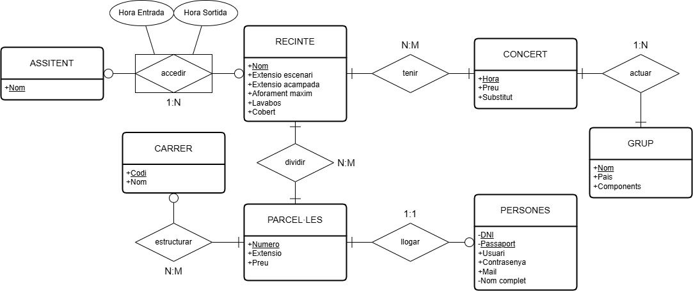

# dissenyBBDD

## BBDD Relacional: Festival de música

La entidad RECINTE tiene relación directa con ASSISTENT, PARCEL·LES y CONCERT.

Su relación con ASSISTENT se debida a que se menciona que se permite el acceso incontrolado de entrada y salida de assistentes, sin embargo, se registran las horas de entrada y salida,
por este motivo se considera la relación de &lt;accedir&gt; como entidad, pues esta contiene los atributos de horas de salida y entrada.

Con PARCEL·LES su relación se basa en la división del recinto por la estructura de calles que tiene, que sería la siguiente relación siguiendo con la linea. Con esta entidad la relación es de varios a varios, pues todos los recintos se dividen en parcelas.

Por otra parte, PARCEL·LES tiene relación con PERSONES, pues esta se puede alquilar a un unico responsable, lo que equivale a una relación de 1 a 1, pues un solo responsable puede alquilar una unica parcela.

La entidad CONCERTS tiene una relación varios a varios porque se menciona que todos los recintos tienen conciertos. Siguiendo con esta linea, aparece la relación con los GRUPS que tocan en los conciertos, y  estos tienen una relación de 1 a varios porque un concierto puede tener varios grupos en distintas horas y precios. Por esto mismo es CONCERTS quien tiene el atributo de Preu.
